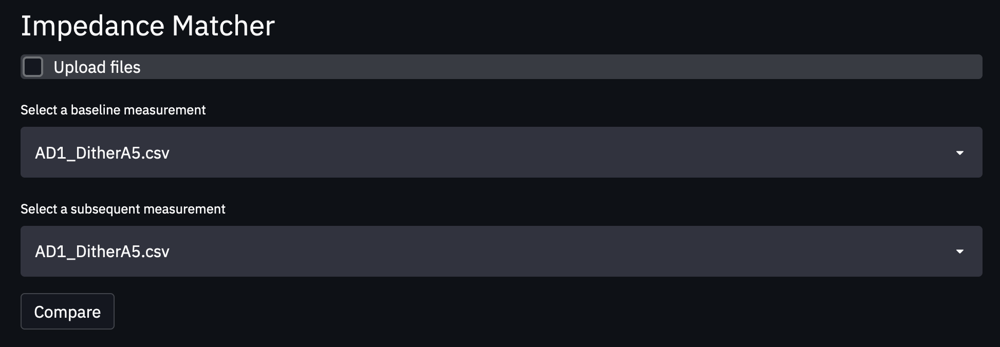
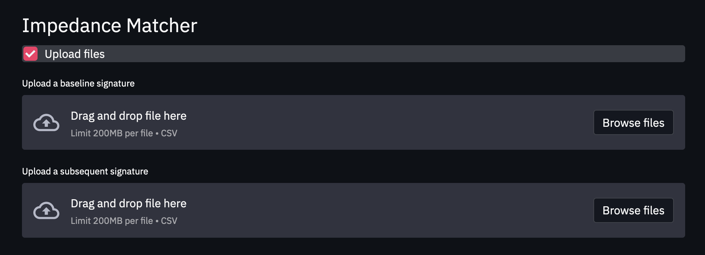

# Impedance Matcher

This tool provides an interface for comparing impedance signature measurements from arbitrary specimens to determine impedance signature similarity subject to different metrics such as response values or peak prominence.

# Background

The goal of this work is to identify a robust intermediate representation for raw impedance signature data which is tolerant to some degree of noise while also uniquely identifying the measured specimen. 

The core challenge here is to convert the impedance signature $I \in \mathbb{R}^{n}$ to an intermediate representation of $I' \in \{0, 1\}^{*}$ which is reflective of the original real-valued response and amenable to reasoning about distance in the security domain (e.g. Hamming distance, edit distance, or set difference). In other words, we seek a binary construction from a 1D signal representing the [electromechanical impedance](https://www.ndt.net/article/ewshm2012/papers/fr1b4.pdf) response of a specimen of interest such that $I' = f(I)$ for some distance preserving transformation $f:\mathbb{R}^{n} \rightarrow \mathbb{Z}_{2}$.  [Fuzzy extractors](https://arxiv.org/abs/cs/0602007.pdf) are one type of security primitive used in biometric authentication for e.g. retinal or fingerprint scans, but become intractable with large input size. Additionally, there are some requirements on the source distribution (e.g. *fuzzy min-entropy*) to maintain certain security guarantees with Fuzzy extractors. Identifying these properties in  impedance signature space and understanding the distribution of impedance signatures given a specimen remains part of ongoing work. 

# Data

To upload data that persists in the application, upload `.csv` files into the `data` folder. Be sure to adhere to the naming convention of `AnalyzerID_SpecimenID_(scan #).csv` for consistency. Otherwise, you can upload your own local files for comparison by checking the `Upload files` option as shown below

# Run

To use matcher,

- clone this repository
- create and/or activate a python virtual environment (assumes python 3)
  - create with `python -m venv ~/path/to/new/env` (e.g. ~/envs/myEnv)
  - activate with `source ~/envs/myEnv/bin/activate`
  - deactivate with `deactivate`
- run `pip install -r requirements.txt` to install dependencies 
-  `cd` into the `src` directory
- run `streamlit run matcher.py` and navigate to the displayed localhost url

