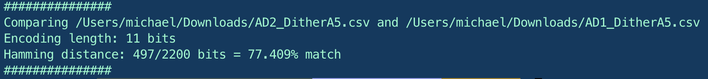
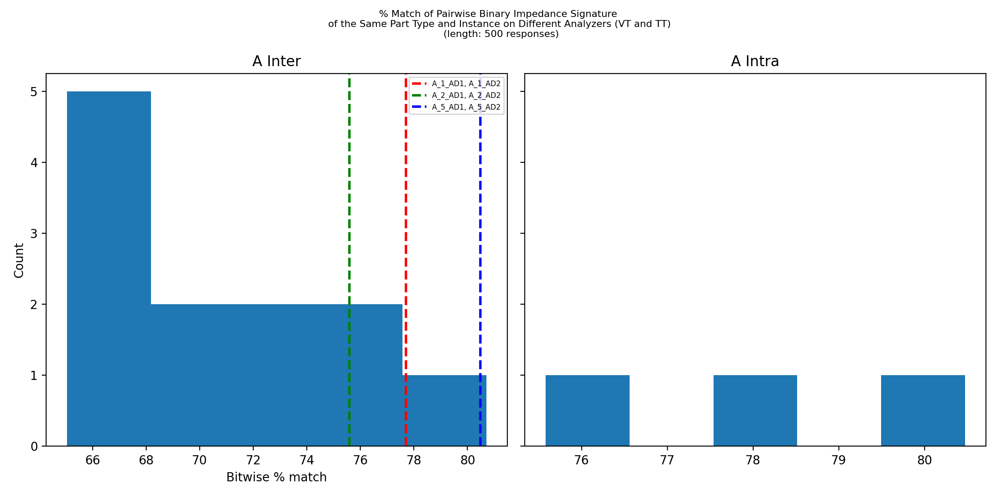
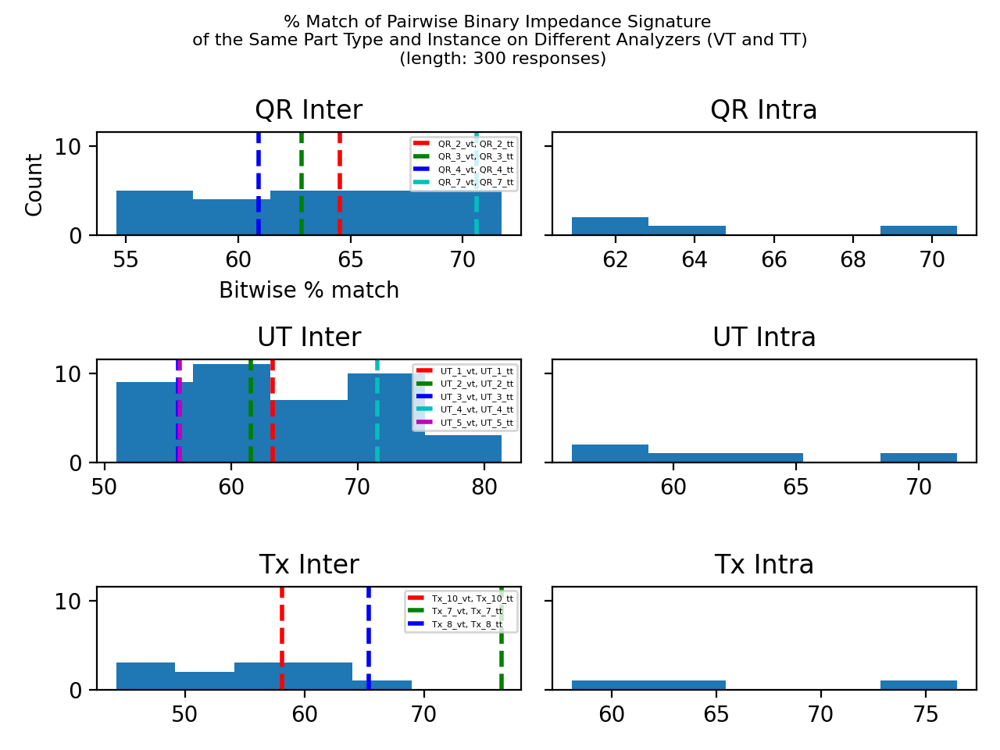

# Overview

This script can be used to compare multiple impedance signatures represented in binary and return a bitwise percent match based on the Hamming Distance between the binary representations. 

the tool is structured as follows: 

- `test` contains 6 total csv files of impedance measurements for 3 different specimens measured on 2 different analyzers at Virginia Tech

- `VT` contains 12 total csv files of impedance measurements for specimens also measured at Virginia Tech

  - The expected format of the `VT` data is 3 column csv file containing frequency, real impedance, imaginary impedance (no file header)

- `TT` also contains 12 csv files of impedance measurements for the same specimens as the `VT` folder except measurements were taken at Tennessee Tech on a different analyzer.

  - The expected format of the `TT` data is a txt file of 5 columns which are described in the file header and semi-colon separated values with the first entry containing the frequency and the last entry containing the real response value

- Dependencies:

  matplotlib==3.3.2
  numpy==1.19.2
  pandas==1.1.3
  tqdm==4.50.2

# Usage

1. In a python virtual environment (recommended), run `pip install -r requirements.txt` to install dependencies from the root of this folder.
2. To compare two files, specify `-f1`  for file 1 followed by an absolute path and same for `-f2`. This might look something like: `python cli.py -f1 /Users/michael/Downloads/AD2_DitherA5.csv -f2 /Users/michael/Downloads/AD1_DitherA5.csv`. Note that 2 files must be specified, and the tool expects the absolute path of each file. 
3. To study a group of measurements to compare signature similarity for different components, specify `-group` as either `test` or `all`: `test` will pairwise compare signatures in the `test` data directory and `all` will pairwise compare signatures in both the `VT` and `TT` directories. This might look something like: `python cli.py -group test -l 500` or `python cli.py -group all -l 300` where `-l`  <size> is the number of response values to compare between any 2 signatures (default is 200 and max allowed is 4000)

# Notes

- Related to the length argument of how many response values to compare between 2 sigantures, we observe a lower % match when comparing a larger number of response values between 2 signatures (e.g. 70% match with l=200 and 63% match with l=500) . This is a suspected result of aggregated interpolation error from different analyzer configurations and is not quantified here but is worth noting.

# Examples 

Here is the result of running the command shown in 2. of Usage (note the absolute paths will differ):

Here is the result of running the first command shown in 3. of Usage:

Here is the result of running the second command shown in 3. of Usage:

